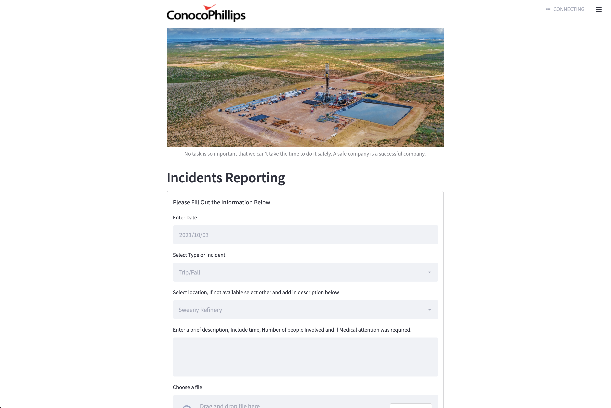
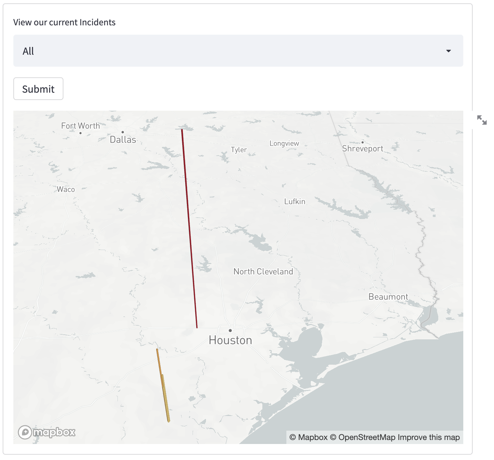
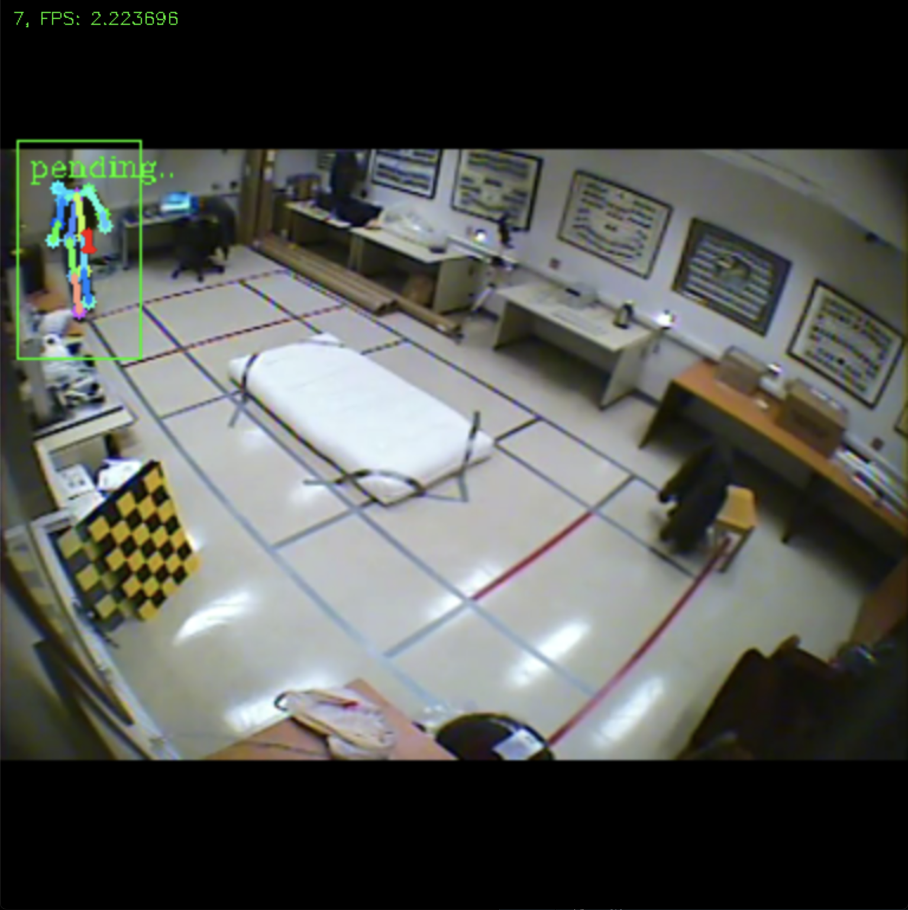

# IncidenceReporting

Reporting and Visualization for Hazardous Events

## Problem Statement
Create a solution that spreads awareness of, visualizes the importance of, and/or decreases the time-to-action of safety-related incidents or topics.

Example safety-related incidents: 1) Identification and reporting of tripping hazards 2) Personnel near heavy machinery 3) Escape of toxic gases

## Solution
Video data is collected to detect if someone has fallen, or if personnel are too near heavy machinery, or if another safety-related incident has happened. If a someone is too near heavy machinery, a notification will be sent out to them. Additionally, we have a webpage to visualize safety incidents geographically and topically, and we also have a place for people to write anonymous incidence reports.

# Description

**Inspiration for your submission**
 - Our inspirtaion came from Conoco Phillip's Spirit Values. We wanted to create something that represented these values and we believe our application does an excellent representation. 
 - SAFETY - Safety is the core idea of our application. We wanted to provide an objective solution to safety.
 - PEOPLE - The people is what drives this application. We gave them the power to view and upload data. 
 - IINTEGRITY - Integrity is extremely important and this application provides transperancy to our people.
 - RESPONSIBILITY - We believe everyone one is respsonisble and this will provide employees with more accountability. 
 - IINNOVATION - Innovation is what powers this application our fall detection will help us identify safety issues througout Conoco Phillips.
 - TEAMWORK - Together we can create technology to keep us safe and responsible. 

**What your submission does**
 - Tripping hazards and heavy machinery incident reporting web app
 - Automatic incident reporting
 - Automatic fall detection and reporting using ML 
 - Fall recording logging using EchoAR

**How you built it**
 - Streamlit
 - python
 - C++
 - Firebase

**Challenges that you ran into, and how you overcame them**
 - Machine Learning Model was tricky to set up
 - Map was not working for a long time

**Accomplishments that you're proud of**
 - Elegant UI
 - Email integration
 - Pose Estimation

**What's next for your product?**
 - Integration with CCTV cameras
 - adapt solution to companies other than ConocoPhillips. We feel our solution can be applied to any company with workplace safety issues
 - Our team split up the work to most efficiently produce a working front end and back end. The front end of our product was constructed using Streamlit, which is a web-app framework that writes markdown from python. This allowed us to easily construct forms and display data in a visually easy-to-digest way for the user. Our data would be stored on a local SQL database such as MySQL, which was able to communicate with our product through the MySQL-Connector python library. Finally, our product also includes a machine learning model that can detect incedents and automatically report them and store the data in the database.

**Challenges that you ran into, and how you overcame them**
 - We faced adversities when attempting to integrate the different parts of our product together such as the database, machine learning, and the front end data visualization components. We overcame these by adapting a 

**Accomplishments that you're proud of**
 - We are proud of producing a Minimum Viable Product that we could showcase to the company and that we believe suits a broad set of use-cases.

**What's next for your product?**
 - In the future, we hope to update our product in terms of specificity and scale. Some ideas that encompass this could include more incident types and more complex query abilities for the user.
